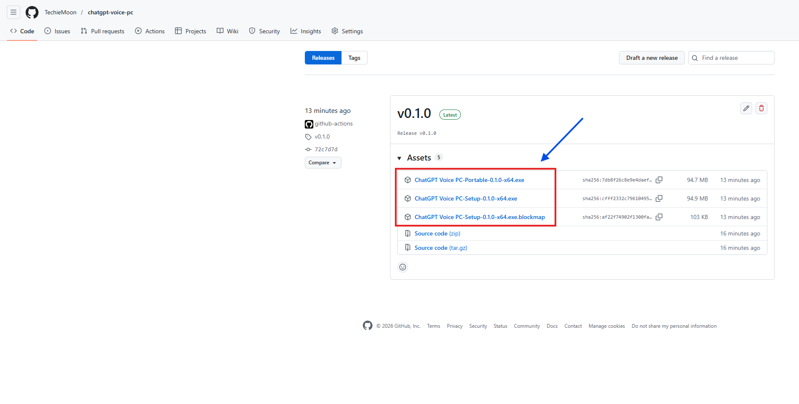
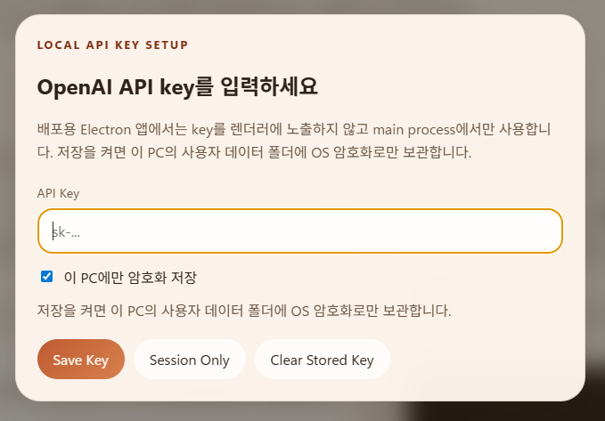
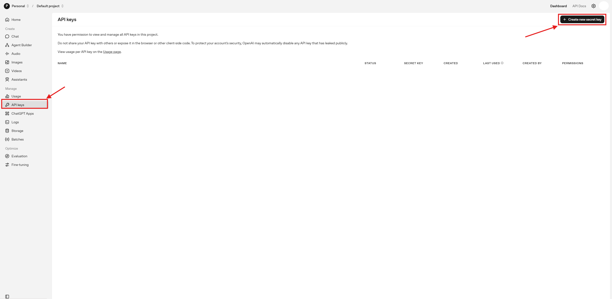
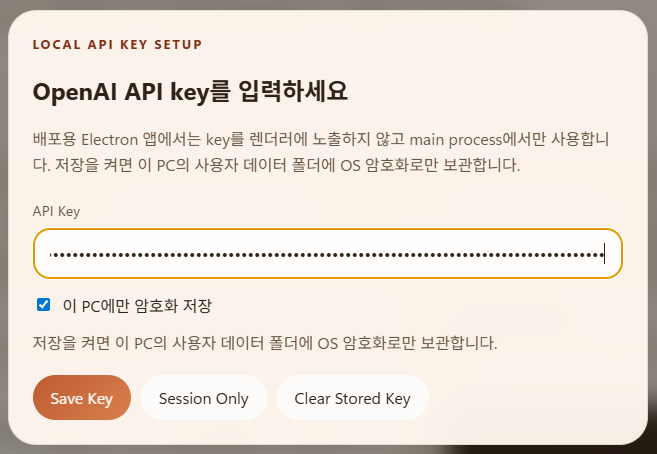
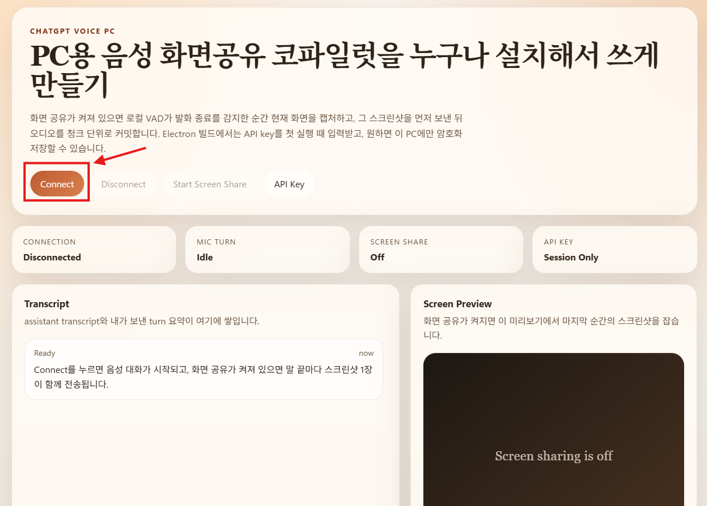
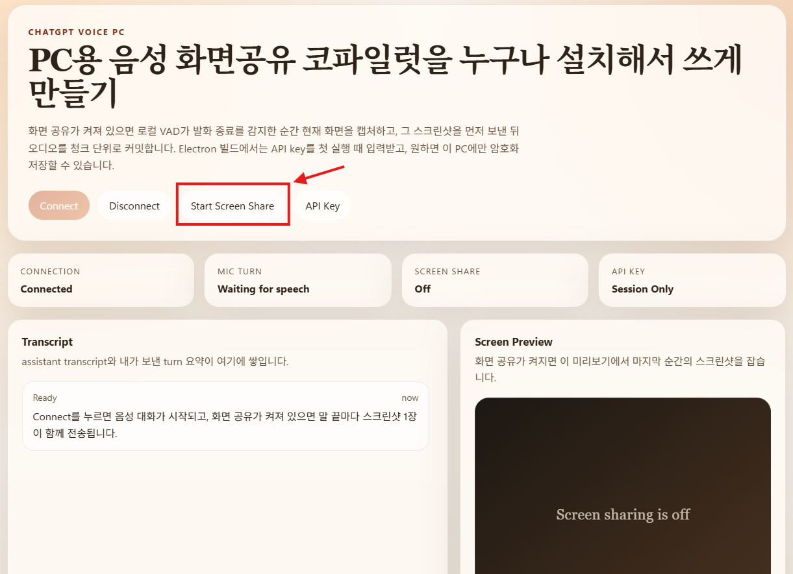
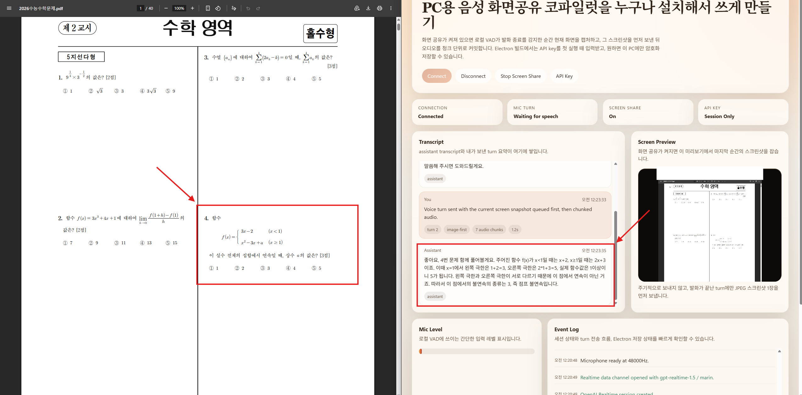

# ChatGPT Voice PC

PC에서 음성으로 대화하고, 필요할 때 현재 보고 있는 화면을 함께 보여줄 수 있는 Electron 앱입니다.

이 앱은 OpenAI의 공식 ChatGPT 앱이 아닙니다. OpenAI Realtime API를 이용해 만든 개인 프로젝트이며,
사용자는 본인 OpenAI API key를 직접 입력해서 사용합니다.

## 이 앱으로 할 수 있는 것

- 음성으로 자연스럽게 대화하기
- 버튼으로 화면 공유 켜기 / 끄기
- 말을 마친 순간의 화면 스크린샷 1장만 함께 보내기
- OpenAI API key를 이번 실행에만 쓰거나, 이 PC에만 암호화 저장하기

## 먼저 알아두세요

- 이 앱을 쓰려면 **본인 OpenAI API key** 가 필요합니다.
- 사용 요금은 **사용자 본인의 OpenAI 계정** 에 청구됩니다.
- 저장을 선택한 API key는 **이 PC에만** 암호화 저장됩니다.
- Windows에서 처음 실행할 때 SmartScreen 경고가 나올 수 있습니다.

## 가장 쉬운 설치 방법

1. GitHub Releases 페이지에서 최신 파일을 받습니다.
2. 아래 둘 중 하나를 실행합니다.
   - `ChatGPT Voice PC-Setup-...exe` : 설치형
   - `ChatGPT Voice PC-Portable-...exe` : 바로 실행형



## 첫 실행 방법

### 1. 프로그램 실행

앱을 실행하면 API key 입력 창이 나옵니다.



### 2. OpenAI API key 만들기

1. OpenAI Platform 사이트에 로그인합니다.
2. API Keys 페이지로 들어갑니다.
3. `Create new secret key` 버튼을 누릅니다.
4. 새 key를 만든 뒤 바로 복사해 둡니다.



### 3. 앱에 API key 입력

1. 복사한 API key를 입력합니다.
2. 원하면 `이 PC에만 암호화 저장` 옵션을 켭니다.
3. 저장을 원하지 않으면 이번 실행에만 사용할 수도 있습니다.



### 4. 음성 연결 시작

1. `Connect` 버튼을 누릅니다.
2. 마이크 권한 요청이 나오면 허용합니다.
3. 연결이 끝나면 바로 대화할 수 있습니다.



### 5. 화면 공유 켜기

1. `Start Screen Share` 버튼을 누릅니다.
2. 공유할 화면 또는 창을 고릅니다.
3. 이후에는 말을 마친 순간의 화면 한 장만 함께 전송됩니다.



## 실제 사용 방법

1. 먼저 `Connect` 를 누릅니다.
2. 화면도 같이 보여주고 싶다면 `Start Screen Share` 를 누릅니다.
3. 자연스럽게 말합니다.
4. 말이 끝나면 앱이 그 턴의 음성과 화면 정보를 보냅니다.
5. 모델 음성이 바로 재생됩니다.



## API key 저장 방식

- `이번 실행만 사용`
  - key를 메모리에만 보관합니다.
  - 프로그램을 끄면 다시 입력해야 합니다.

- `이 PC에만 암호화 저장`
  - 다음 실행부터 다시 입력하지 않아도 됩니다.
  - 저장된 key는 Electron의 OS 암호화 저장 기능을 사용해 보관합니다.

## 자주 겪는 문제

### 1. 화면 공유가 안 돼요

- 다시 `Start Screen Share` 를 눌러서 화면 또는 창을 다시 선택해 보세요.
- 브라우저/앱 권한 창이 떴다면 허용해 주세요.

### 2. 연결이 안 돼요

- 인터넷 연결을 확인해 주세요.
- 입력한 OpenAI API key가 맞는지 확인해 주세요.
- OpenAI 계정의 API 사용 가능 상태를 확인해 주세요.

### 3. 소리가 안 들려요

- PC 출력 장치가 맞는지 확인해 주세요.
- 앱 음소거 상태가 아닌지 확인해 주세요.

## 개인정보와 비용

- 사용자의 음성, 스크린샷, 텍스트는 OpenAI API로 전송될 수 있습니다.
- 이 앱은 사용자 본인의 API key를 사용하므로, 사용 비용도 사용자 본인의 OpenAI 계정에 청구됩니다.
- 민감한 화면을 공유하기 전에 현재 보이는 내용을 꼭 확인해 주세요.

## 개발자를 위한 실행 방법

소스코드에서 직접 실행하고 싶다면:

```bash
npm install
npm start
```

Windows 배포 파일을 직접 만들고 싶다면:

```bash
npm run dist:win
```

## 이미지 넣는 방법

README 중간의 이미지들은 아래 경로를 바라보도록 미리 연결되어 있습니다.

```text
docs/readme-images/image1.png
docs/readme-images/image2.png
docs/readme-images/image3.png
docs/readme-images/image4.png
docs/readme-images/image5.png
docs/readme-images/image6.png
docs/readme-images/image7.png
```

나중에 이 파일 이름으로 이미지를 넣으면 README에 자동으로 보입니다.
